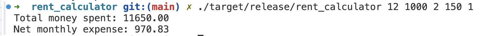

# Rent Calculator CLI

[](https://github.com/nogibjj/JamieLiu_Mini7/actions/workflows/CI.yml)

## What This CLI Does

The Rent Calculator CLI helps you compute:

1. **Total Money Spent**: The total amount you’ll spend on rent and utilities over a specific rental period, accounting for any free months.
2. **Net Monthly Expense**: The average monthly cost over the entire rental period, taking into account free months for both rent and utilities.

You input the total number of months, monthly rent, free months, monthly utilities, and free months for utilities. The CLI will output both the total money spent and your average monthly expenses, providing you with a quick financial overview of your rental agreement.

---

## Usage

1. **Clone the Repository**:
   Clone the repository to your local machine:

   ```bash
   git clone git@github.com:nogibjj/JamieLiu_Mini7.git
   cd rent_calculator
   ```

2. **Build the Project**:
   Build the project to resolve dependencies and create an executable:
   ```bash
   cargo build --release
   ```
3. **Running Tests**:
   Run the tests to ensure everything is working correctly:

   ```bash
   cargo test
   ```

4. **Run the CLI Tool**:
   After building, run the tool by providing the required arguments:

   ```bash
   ./target/release/rent_calculator [NUMBER_OF_MONTHS_TO_RENT] [MONTHLY_RENT] [NUMBER_OF_FREE_MONTHS] [MONTHLY_UTILITIES] [NUMBER_OF_FREE_MONTHS_UTILITIES]
   ```

   For example:
   

---

## Dependencies

The Rent Calculator CLI uses **Clap** for command-line argument parsing.

Add this to your `Cargo.toml` if not already included:

```toml
[dependencies]
clap = { version = "4.5.20", features = ["derive"] }
```

Cargo will automatically install dependencies when building the project.

---
